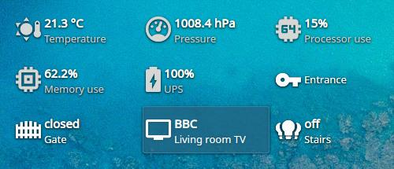

# Home Assistant Plasmoid

[][kdestore]
[][releases]
[][releases]

Add Home Assistant to your plasma desktop.



## Features

* Show entity state or attribute
* Call services
* Notify about entity changes

## Use

1. Enter the URL of the Home Assistant instance
2. Create Long Lived Access Token on your Home Assistant Profile page (https://<your_ha_address>/profile) and put it in the plasmoid configuration
3. Add entities

## Requirements

* Active KDE Wallet
* Qt >= 5.14, KDE Frameworks >= 5.77, KDE Plasma >= 5.19 (e.g. Kubuntu 21.04 and newer)
* **Qt WebSocket package installed**
  
  Base | Required package
  --|--
  Debian, Ubuntu | qml-module-qtwebsockets
  Arch | qt5-websockets
  Fedora | qt5-qtwebsockets-devel
  openSUSE | libQt5WebSockets5
  NixOS | libsForQt5.qt5.qtwebsockets

  **Please remember to restart plasma or re-login after installing the dependency.**

## Installation

**The preferred and easiest way to install is to use Plasma Discover or KDE Get New Stuff and search for *Home Assistant*.**

### From file

Download the latest version of plasmoid from [KDE Store][kdestore]

#### A) Plasma UI

1. Right click on panel or desktop
2. Select *Add Widgets > Get New Widgets > Install From Local File*
3. Choose downloaded plasmoid file

#### B) Terminal

```sh
plasmapkg2 -i plasma-homeassistant-*.plasmoid
```

### From GitHub

Clone repository and go to the project directory

```sh
git clone --recurse-submodules https://github.com/korapp/plasma-homeassistant.git
cd plasma-homeassistant
```

Install

```sh
plasmapkg2 -i package
```

## Support

Say thank you with coffee ☕ if you'd like.

[](https://liberapay.com/korapp/donate)
[](https://ko-fi.com/korapp)
[](https://revolut.me/korapp)

[kdestore]: https://store.kde.org/p/2070431/
[releases]: https://github.com/korapp/plasma-homeassistant/releases